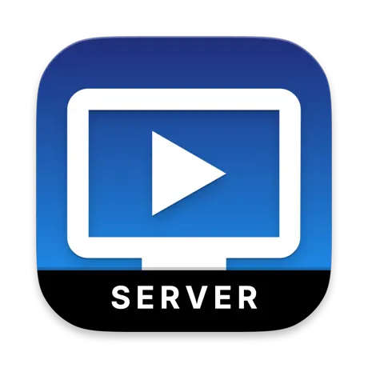

Success Stories
===============

Want to see examples of Toga in use? Here's some:

.. list-table::
   :header-rows: 1
   :widths: 25 20 25 30

   * - Application
     - Platforms
     - Screenshots
     - Description

   * - |travel-tips-icon| `Travel Tips <https://apps.apple.com/au/app/travel-tips/id1336372310>`_
     - Android, iOS
     - iPad_
     - A currency conversion tool that can also calculate tips.

   * - |eddington-icon| `Eddington <https://github.com/EddLabs/eddington-gui>`_
     - Cross-platform
     - Screenshots coming soon
     - A data fitting tool.

   * - |ta-rpn-calc-tg-icon| `taRpnCalcTG <https://www.tanapro.ch/joomla3/index.php/downloads>`_
     - Android, Windows, macOS
     - Screenshots coming soon
     - A calculator which is extensible with Python scripts.

   * - |py-playground-icon| `pyPlayground <https://www.tanapro.ch/joomla3/index.php/downloads>`_
     - Android, Windows
     - Screenshots coming soon
     - An app which can be modified to try Toga without an additional tool chain.

   * - |taapplister-icon| `taAppLister <https://play.google.com/store/apps/details?id=ch.tanapro.taapplister>`_
     - Android
     - Screenshots coming soon
     - An Android app for listing and exporting all installed apps.

   * - `RemoteCommand <https://www.tanapro.ch/joomla3/index.php/downloads>`_
     - Windows, macOS
     - Screenshots coming soon
     - An app for synchronizing the clipboard between computers.

   * - |chariotgazer-icon| `ChariotGazer <https://insanesharpness.gitlab.io/ChariotGazer/>`_
     - Android, Windows
     - Screenshots coming soon
     - An app which provides detailed information about UK registered vehicles.

   * - |patent-toolkit-icon| `Patent Toolkit <https://patenttk.com/>`_
     - Windows, macOS
     - Screenshots coming soon
     - An app which contains a suite of tools for patent professionals.

   * - |easy-media-server-icon| `Easy Media Server <https://apps.rsmail.co/easy-media-server>`_
     - macOS
     - Screenshots coming soon
     - A macOS DLNA media server for streaming content to devices such as Smart TVs.

.. |chariotgazer-icon| image:: ../images/success_stories/chariotGazer/chariot_gazer_logo.ico
   :width: 32px
   :height: 32px

.. _iPad: ../images/success_stories/travel_tips/travel_tips_ipad_screenshot.webp
