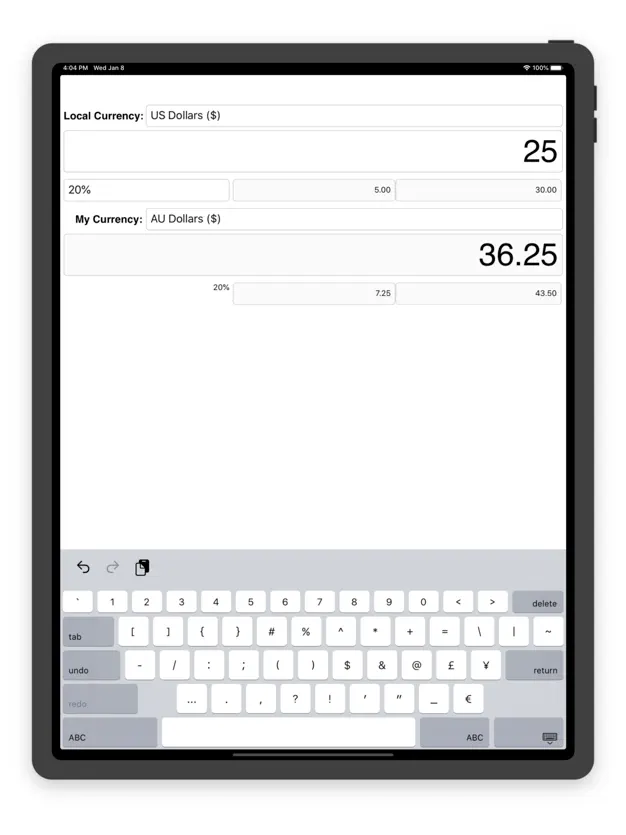
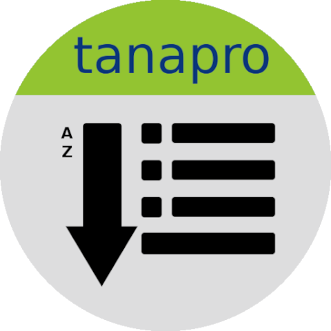
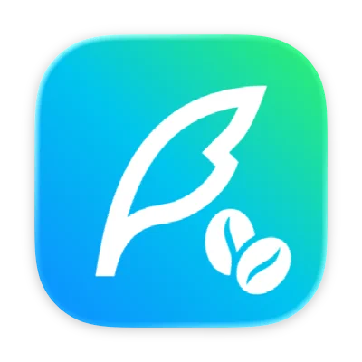

# Success stories

Want to see examples of Toga in use? Here are some.

## { .success-story-icon } [Travel Tips](https://apps.apple.com/au/app/travel-tips/id1336372310)

{ .success-story-screenshot }

**Platform:** iOS

App Store app that uses Toga to define its user interface.

## { .success-story-icon } [Eddington](https://github.com/EddLabs/eddington-gui)

Data fitting tool based on Toga and Briefcase.

## { .success-story-icon } [taRpnCalcTG](https://www.tanapro.ch/joomla3/index.php/downloads)

**Platforms:** Android, Windows, macOS

Extensible calculator with Python scripting support.

## { .success-story-icon } [pyPlayground](https://www.tanapro.ch/joomla3/index.php/downloads)

**Platforms:** Android, Windows

App for experimenting with Toga without setting up the full development tooling.

## { .success-story-icon } [taAppLister](https://play.google.com/store/apps/details?id=ch.tanapro.taapplister)

**Platform:** Android

App for listing and exporting installed apps.

## [RemoteCommand](https://www.tanapro.ch/joomla3/index.php/downloads)

**Platforms:** Windows, macOS

App for clipboard synchronization between desktop systems.

## { .success-story-icon } [ChariotGazer](https://insanesharpness.gitlab.io/ChariotGazer/)

**Platforms:** Android, Windows

Provides detailed information about UK registered vehicles.

## { .success-story-icon } [Patent Toolkit](https://patenttk.com)

**Platforms:** Windows, macOS

Suite of productivity tools for patent professionals.

## { .success-story-icon } [Easy Media Server](https://apps.rsmail.co/easy-media-server)

**Platform:** macOS

DLNA media server for streaming content to devices such as Smart TVs.

## { .success-story-icon } [Beanquick](https://twobitsware.com/beanquick)

**Platform:** macOS

Fast desktop app for double-entry bookkeeping.

