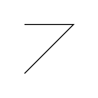
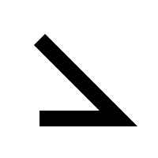
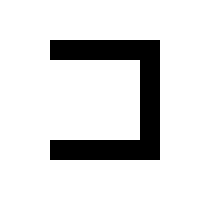

# Advanced Canvas usage

For many if not most applications, the straightforward Canvas interface described on the [main page](./index.md) is sufficient. However, it is also possible to directly manipulate a Canvas's internal representation of its stored instructions, thereby modifying the results in a nonlinear fashion.

## Internal data structure

Internally, each drawing operation is represented by an object of class [`DrawingAction`][toga.widgets.canvas.DrawingAction]. Each drawing method has a corresponding `DrawingAction` subclass of the same name, except in CamelCase. For example, the [`line_to()`][toga.Canvas.line_to] method creates a [`LineTo`][toga.widgets.canvas.LineTo] object, and `LineTo` is a subclass of `DrawingAction`.

The current state of the drawing context is represented by a state object. All states are subclasses of the abstract [`BaseState`][toga.widgets.canvas.BaseState]; the simplest is [`State`][toga.widgets.canvas.State]. Initially, a canvas has only one state; this initial state is always accessible via the canvas's [`root_state`][toga.Canvas.root_state] attribute.

Each state stores a [list of its associated drawing actions][toga.widgets.canvas.BaseState.drawing_actions].

```python
import toga

canvas = toga.Canvas()

print(canvas.root_state)
# State()
print(canvas.root_state.drawing_actions)
# []

canvas.rect(0, 0, 10, 10)
canvas.stroke()

print(canvas.root_state.drawing_actions)
# [Rect(x=0, y=0, width=10, height=10),
#  Stroke(stroke_style=None, line_width=None, line_dash=None)]

```

When you save and then restore the state of the drawing context using a context manager (e.g., [`state()`][toga.Canvas.state], [`stroke()`][toga.Canvas.stroke], or [`fill()`][toga.Canvas.fill]), a new state object is created and inserted into the currently active state's `drawing_actions`.

```python
# (Continued from above)

with canvas.state():
    canvas.line_width = 10
    canvas.line_dash = [1, 2]

canvas.fill()

print(canvas.root_state.drawing_actions)
# [Rect(x=0, y=0, width=10, height=10),
#  Stroke(stroke_style=None, line_width=None, line_dash=None),
#  State(),
#  Fill(fill_rule=FillRule.NONZERO, fill_style=None)]
```

The actions corresponding to setting line width and line dash are contained inside the [`State()`][toga.widgets.canvas.State], like so:

```text
root_state ─┬─ Rect
            ├─ Stroke
            ├─ State ──┬─ SetLineWidth
            └─ Fill    └─ SetLineDash

```

Note that the the `Fill` isn't inside the `State`, because its method was called after the context manager exited.

## Accessing specific DrawingActions

Say you wanted to access the [`Fill`][toga.widgets.canvas.Fill] object in the above example. A state's drawing actions are a list, so you could manually index like so:

```python
fill = canvas.root_state.drawing_actions[3]
```

However, this is not very practical, especially if the action of interest is nested within several states. A better way is to leverage the fact that each drawing method returns its drawing action. The line calling the fill method can be changed to:

```python
fill = canvas.fill()
```

And now `fill` is a direct reference to the `Fill` object.

The same is true even when a method is being used as a [context manager](https://docs.python.org/3/reference/datamodel.html#context-managers), so you can assign to it with the `with ... as ...` syntax. For instance, the following code would bind `fill`, `stroke`, and `move_to` to the `Fill`, `Stroke`, and `MoveTo` drawing actions created by the methods called:

```python
with canvas.fill() as fill:
    with canvas.stroke() as stroke:
        move_to = canvas.move_to(0, 0)
```

## Modifying attributes of DrawingActions

As you've probably guessed from their printed representations above, `DraingAction`s have attributes corresponding to the equivalent method's parameters. If you modify these attributes, it will retroactive alter what is drawn on the canvas.

For example, consider the following code and its output:

```python
import toga

canvas = toga.Canvas(width=200, height=200)
with canvas.stroke() as stroke:
    canvas.move_to(50, 50)
    first_line = canvas.line_to(150, 50)
    canvas.line_to(50, 150)
```



Since we've saved references, we can go on to alter the parameters of the stroke and the first line segment. After altering attributes like this, the canvas's `redraw()` method needs to be called to ensure the results are rendered on screen.

```python
stroke.line_width = 20
first_line.y = 150

canvas.redraw()
```



The line has gotten wider, and the second point has moved down to a y coordinate of 150, which alters the orientation of both line segments.

## Creating and adding new DrawingActions

`DrawingActions` can also be created directly, and states' lists of them can be manually altered. As with altering attributes, and direct modification of the lists of drawing actions should be followed by a call to the canvas's `redraw` method.

An extra point could be added to the above path like so:

```python
from toga.widgets.canvas import LineTo

new_point = LineTo(150, 50)
stroke.drawing_actions.insert(1, new_point)

canvas.redraw()
```



This example uses `insert`, but `drawing_actions` is a list, with all of a list's normal methods, including `append`, `remove`, and `extend`. Remember to call `redraw` after any such alterations.

## Reference

::: toga.widgets.canvas.DrawingAction

::: toga.widgets.canvas.BaseState

::: toga.widgets.canvas.SetFillStyle

::: toga.widgets.canvas.SetStrokeStyle

::: toga.widgets.canvas.SetLineWidth

::: toga.widgets.canvas.SetLineDash

::: toga.widgets.canvas.Save

::: toga.widgets.canvas.Restore

::: toga.widgets.canvas.State

::: toga.widgets.canvas.BeginPath

::: toga.widgets.canvas.ClosePath

::: toga.widgets.canvas.MoveTo

::: toga.widgets.canvas.LineTo

::: toga.widgets.canvas.BezierCurveTo

::: toga.widgets.canvas.QuadraticCurveTo

::: toga.widgets.canvas.Arc

::: toga.widgets.canvas.Ellipse

::: toga.widgets.canvas.Rect

::: toga.widgets.canvas.Fill

::: toga.widgets.canvas.Stroke

::: toga.widgets.canvas.WriteText

::: toga.widgets.canvas.DrawImage

::: toga.widgets.canvas.Rotate

::: toga.widgets.canvas.Scale

::: toga.widgets.canvas.Translate

::: toga.widgets.canvas.ResetTransform
