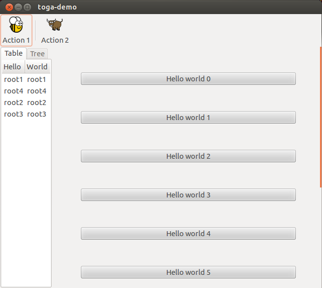

# Linux/Unix (GTK)

{ width="300px" }

/// caption

///

<!-- TODO: Update alt text -->

The Toga backend for Linux (and other Unix-like operating systems) running the GNOME desktop environment is [`toga-gtk`](https://github.com/beeware/toga/tree/main/gtk).

/// admonition | GTK on Windows and macOS

Although GTK *can* be installed on Windows and macOS, and the `toga-gtk` backend *may* work on those platforms, this is not officially supported by Toga. We recommend using `toga-winforms` on [Windows][], and `toga-cocoa` on [macOS][].

///

[](){ #linux-prerequisites }

[](){ #gtk-prerequisites }

## Prerequisites  { #gtk-prerequisites }

`toga-gtk` requires Python 3.10+, and GTK 3.22 or newer.

Most testing occurs with GTK 3.24 as this is the version that has shipped with all versions of Ubuntu since Ubuntu 20.04, and all versions of Fedora since Fedora 32.

The system packages that provide GTK must be installed manually:

-8<- "reference/platforms/gtk-prerequisites.md"

Toga does not currently support GTK 4.

## Installation

`toga-gtk` is installed automatically on any Linux machine (machines that report `sys.platform == 'linux'`), or any FreeBSD machine (machines that report `sys.platform == 'freebsd*'`). It can be manually installed by running:

```console
$ python -m pip install toga-gtk
```

## Implementation details

The `toga-gtk` backend uses the [GTK3 API](https://docs.gtk.org/gtk3/).

The native APIs are accessed using the [PyGObject binding](https://pygobject.readthedocs.io).
