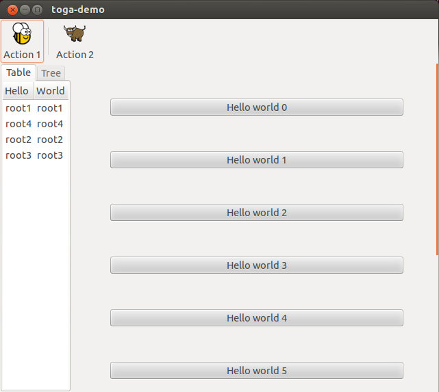

# Linux/Unix (GTK)

{ width="300px" }

/// caption

///

<!-- TODO: Update alt text -->

The Toga backend for Linux (and other Unix-like operating systems) running the GNOME desktop environment is [`toga-gtk`](https://github.com/beeware/toga/tree/main/gtk).

/// admonition | GTK on Windows and macOS

Although GTK *can* be installed on Windows and macOS, and the `toga-gtk` backend *may* work on those platforms, this is not officially supported by Toga. We recommend using `toga-winforms` on [Windows][], and `toga-cocoa` on [macOS][].

///

[](){ #linux-prerequisites }

[](){ #gtk-prerequisites }

## Prerequisites  { #gtk-prerequisites }

`toga-gtk` requires Python 3.10+, and GTK 3.22 or newer.

Most testing occurs with GTK 3.24 as this is the version that has shipped with all versions of Ubuntu since Ubuntu 20.04, and all versions of Fedora since Fedora 32.

The system packages that provide GTK must be installed manually:

-8<- "snippets/gtk-prerequisites.md"

Toga has experimental support for GTK 4. GTK 4 support requires a Linux distribution that provides `libgirepository 2.0`. This means it is not possible to use the GTK 4 backend on Debian 11, Debian 12, Ubuntu 22.04, or any other older Debian-based distribution.

## Installation

`toga-gtk` is installed automatically on any Linux machine (machines that report `sys.platform == 'linux'`), or any FreeBSD machine (machines that report `sys.platform == 'freebsd*'`). It can be manually installed by running:

```console
$ python -m pip install toga-gtk
```

### GTK 4 support (experimental)

The experimental GTK 4 backend requires the use of GTK 4.10 or newer. This requirement is met by Debian 13, Ubuntu 24.04, and Fedora 41. Most testing occurs with GTK 4.14, as this is the version that ships with Ubuntu 24.04.

If you want to use the experimental GTK 4 backend, run:

```console
$ python -m pip install toga-gtk[gtk4]
```

and set the `TOGA_GTK` environment variable:
```console
$ export TOGA_GTK=4
```

The experimental GTK 4 backend also aims to provides support for integrating with desktop environment-specific libraries.  At present, `libadwaita` is the only supported library of this kind.  This functionality requires libadwaita 1.5 or newer.  libadwaita integration is automatically enabled on GNOME desktops if GTK4 support is enabled, and automatically disabled on non-GNOME desktops when using GTK4.  To explicitly enable integration with libadwaita, set:
```console
$ export TOGA_GTKLIB=Adw
```
To explicitly disable integration with libadwaita, set:
```console
$ export TOGA_GTKLIB=None
```
An unset or empty ``$TOGA_GTKLIB`` will trigger automatic detection.

Most testing occurs with libadwaita 1.5, as this is the version that ships with Ubuntu 24.04.

We have no immediate plans to integrate with tauOS's libhelium or elementaryOS's Granite, but we're open to contributions adding support for these libraries.

## Implementation details

The `toga-gtk` backend uses the [GTK3 API](https://docs.gtk.org/gtk3/). The experimental GTK 4 `toga-gtk` backend uses the [GTK4 API](https://docs.gtk.org/gtk4/).

The native APIs are accessed using the [PyGObject binding](https://pygobject.readthedocs.io).
