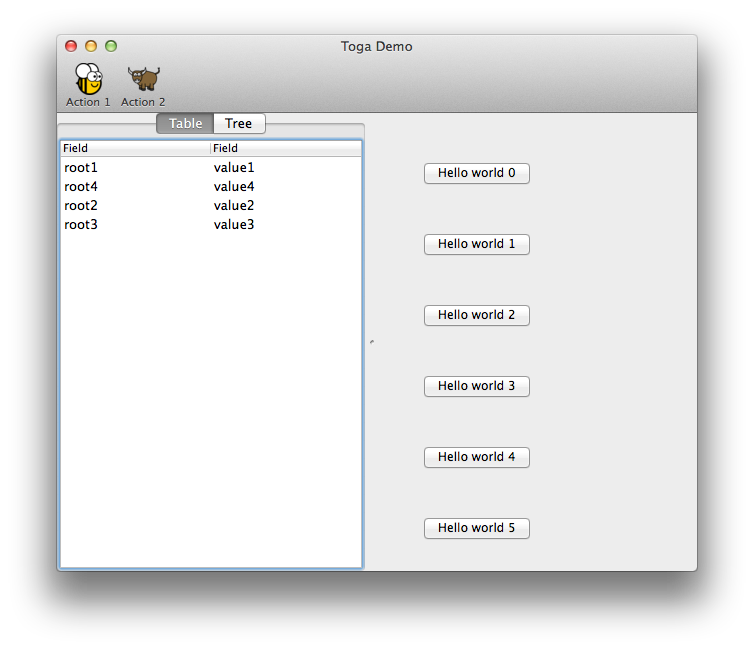

# macOS

{ width="300px" }

/// caption

///

<!-- TODO: Update alt text -->

The Toga backend for macOS is [`toga-cocoa`](https://github.com/beeware/toga/tree/main/cocoa).

## Prerequisites  { #macos-prerequisites }

`toga-cocoa` requires Python 3.10+, and macOS 11 (Big Sur) or newer.

## Installation

`toga-cocoa` is installed automatically on macOS machines (machines that report `sys.platform == 'darwin'`), or can be manually installed by running invoking:

```console
$ python -m pip install toga-cocoa
```

## Implementation details

The `toga-cocoa` backend uses the [AppKit Objective-C API](https://developer.apple.com/documentation/appkit/), also known as Cocoa.

The native APIs are accessed using [Rubicon Objective-C](https://rubicon-objc.readthedocs.io/).
