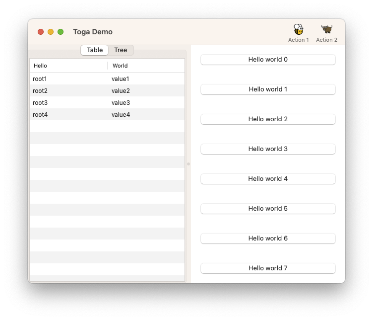

# macOS

{ width="300px" }

/// caption

///

<!-- TODO: Update alt text -->

The Toga backend for macOS is [`toga-cocoa`](https://github.com/beeware/toga/tree/main/cocoa).

## Prerequisites { #macos-prerequisites }

`toga-cocoa` requires macOS 11 (Big Sur) or newer.

## Installation

`toga-cocoa` is installed automatically on macOS machines (machines that report `sys.platform == 'darwin'`), or can be manually installed by running invoking:

```console
$ python -m pip install toga-cocoa
```

## Implementation details

The `toga-cocoa` backend uses the [AppKit Objective-C API](https://developer.apple.com/documentation/appkit/), also known as Cocoa.

The native APIs are accessed using [Rubicon Objective-C](https://rubicon-objc.readthedocs.io/).

## Platform-specific APIs

### App lifecycle hooks

macOS notifies an app of lifecycle events (app launch, activation, hiding, termination, etc.) by calling methods on an `NSApplicationDelegate` instance. Toga's implementation of this delegate hands off every lifecycle notification it receives to a same-named method on the Cocoa `App` implementation class, prefixed with `cocoa_`. For example, the `applicationDidBecomeActive:` notification is handled by `cocoa_applicationDidBecomeActive()` on the Cocoa App class.

An app can hook into a lifecycle event by defining a custom subclass of a platform's App implementation class:

```python
import sys

if sys.platform == "darwin":
    from toga_cocoa.app import App as CocoaApp

    class MyCocoaApp(CocoaApp):
        def cocoa_applicationDidBecomeActive(self, notification):
            # ... custom logic before default Toga implementation ...
            super().cocoa_applicationDidBecomeActive(notification)
            # ... custom logic after default Toga implementation ...
```

You can then direct your app to use this custom class by overriding the [`create()`][toga.App.create] method on your app to construct and return an instance of your custom App class when running on macOS:

```python
class MyApp(toga.App):
    def create(self):
        if sys.platform == "darwin":
            return MyCocoaApp(interface=self)
        else:
            return super().create()

    def startup(self): ...
```

Each hook receives the same arguments as the underlying `NSApplicationDelegate` method (usually an `NSNotification` instance). `cocoa_applicationWillHide()`, `cocoa_applicationDidUnhide()` and `cocoa_applicationDidFinishLaunching()` already implement behavior required by Toga's cross-platform API (e.g. triggering `on_hide`/`on_show` on windows); if you override one of these, call the base implementation to preserve that behavior, as shown in the example above.

The following lifecycle hooks are available:

<!-- rumdl-disable MD013 MD022 MD023 -->
::: toga_cocoa.app.App
    options:
        show_root_heading: false
        show_root_toc_entry: false
        members:
            - cocoa_applicationWillFinishLaunching
            - cocoa_applicationDidFinishLaunching
            - cocoa_applicationWillBecomeActive
            - cocoa_applicationDidBecomeActive
            - cocoa_applicationWillResignActive
            - cocoa_applicationDidResignActive
            - cocoa_applicationWillHide
            - cocoa_applicationDidHide
            - cocoa_applicationWillUnhide
            - cocoa_applicationDidUnhide
            - cocoa_applicationDidChangeScreenParameters
            - cocoa_applicationShouldTerminate
            - cocoa_applicationWillTerminate
