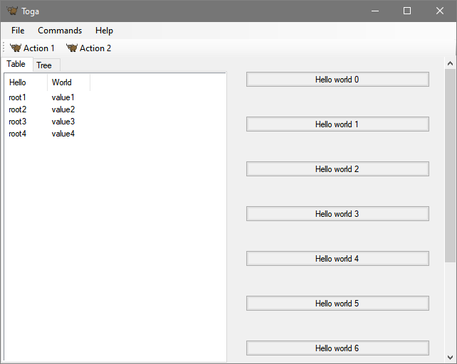

# Windows

{ width="300px" } <!-- TODO: Update alt text -->

The Toga backend for Windows is [`toga-winforms`](https://github.com/beeware/toga/tree/main/winforms).

## Prerequisites  { #windows-prerequisites }

`toga-winforms` requires Python 3.10+, and Windows 10 or newer.

/// note | Note

Toga uses the [Python.NET](https://pythonnet.github.io) library to access the underlying Winforms GUI toolkit on Windows. Unfortunately, Python.NET doesn't always keep up with the release schedule of Python itself, and as a result, may not be compatible with recently-released versions of Python (i.e., a Python release with a version number of 3.X.0 or 3.X.1). If you experience problems installing Toga, and you're using a recently-released version of Python, try downgrading to the previous minor release (e.g. 3.13.9 instead of 3.14.0).

///


If you are using Windows 10 and want to use a WebView to display web content, you will also need to install the [Edge WebView2 Evergreen Runtime.](https://developer.microsoft.com/en-us/microsoft-edge/webview2/#download) Windows 11 has this runtime installed by default.

## Installation

`toga-winforms` is installed automatically on Windows machines (machines that report `sys.platform == 'win32'`), or can be manually installed by running:

```console
$ python -m pip install toga-winforms
```

## Implementation details

The `toga-winforms` backend uses the [Windows Forms API](https://learn.microsoft.com/en-us/dotnet/desktop/winforms/?view=netdesktop-8.0).

The native .NET APIs are accessed using [Python.NET](http://pythonnet.github.io).
