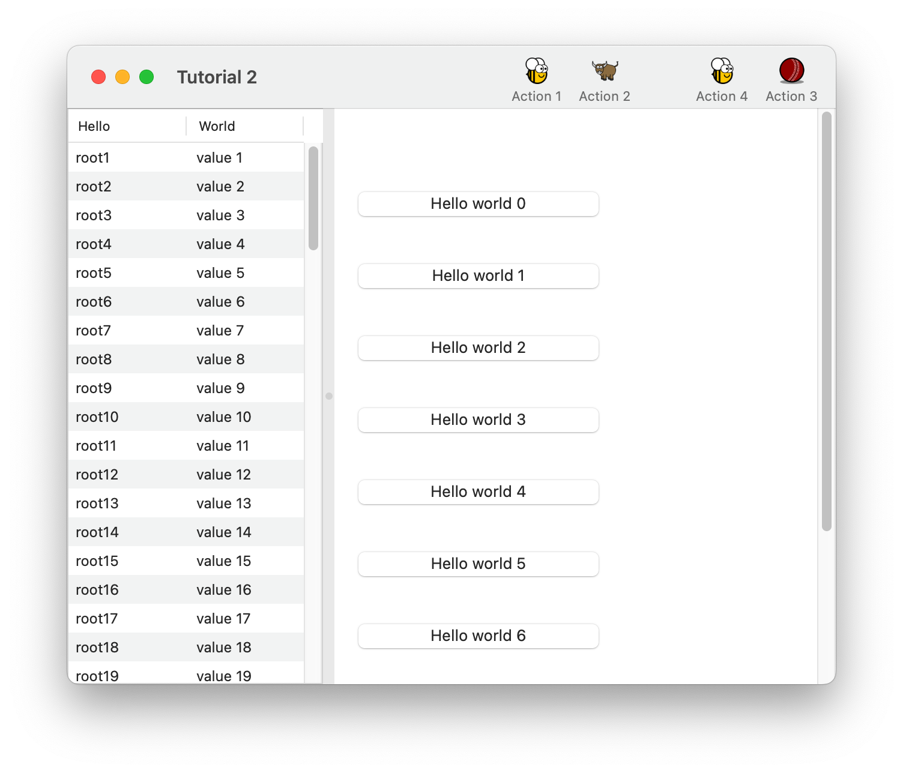
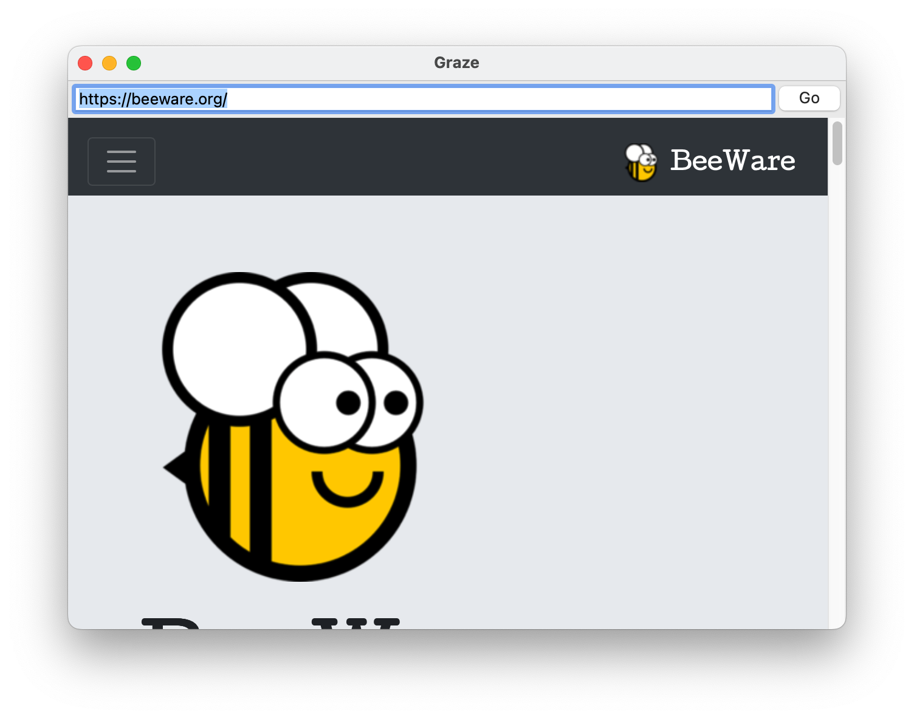
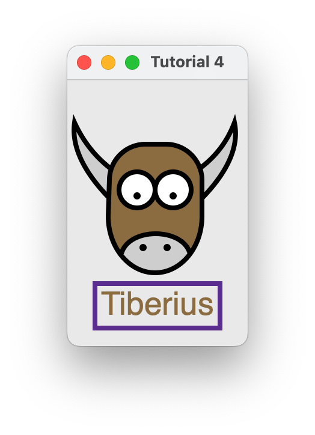

# Tutorials {#tutorial}

:::: {.note}
::: {.title}
Note
:::

Is this the tutorial you're looking for?

If this is your first time using BeeWare, we suggestion you start with
the [BeeWare tutorial](https://docs.beeware.org). This tutorial only
covers BeeWare's GUI toolkit, Toga, and doesn't cover any of the details
of getting your code running on specific hardware platforms. Once you've
completed the BeeWare tutorial, this tutorial will introduce more
details about Toga's capabilities as a GUI toolkit.
::::

::: {.toctree maxdepth="1" hidden="" titlesonly=""}
Get started \<get-started\> tutorial-0 tutorial-1 tutorial-2 tutorial-3
tutorial-4
:::

## A quick test drive

Before you run through the tutorial,
`install a Toga app <get-started>`{.interpreted-text role="doc"} to see
what Toga looks like.

## Tutorial 0 - your first Toga app

In `tutorial-0`{.interpreted-text role="doc"}, you will discover how to
create a basic app and have a simple `~toga.Button`{.interpreted-text
role="class"} widget to click.

## Tutorial 1 - a slightly less toy example

In `tutorial-1`{.interpreted-text role="doc"}, you will discover how to
capture basic user input using the `~toga.TextInput`{.interpreted-text
role="class"} widget and control layout.

## Tutorial 2 - you put the box inside another box... {#tutorial-2---you-put-the-box-inside-another-box...}

In `tutorial-2`{.interpreted-text role="doc"}, you will discover how to
use the `~toga.SplitContainer`{.interpreted-text role="class"} widget to
display some components, a toolbar and a table.

<figure class="align-center">

</figure>

## Tutorial 3 - let's build a browser!

In `tutorial-3`{.interpreted-text role="doc"}, you will discover how to
use the `~toga.WebView`{.interpreted-text role="class"} widget to
display a simple browser.

<figure class="align-center">

</figure>

## Tutorial 4 - let's draw on a canvas!

In `tutorial-4`{.interpreted-text role="doc"}, you will discover how to
use the `~toga.Canvas`{.interpreted-text role="class"} widget to draw
lines and shapes on a canvas.

<figure class="align-center">

</figure>
