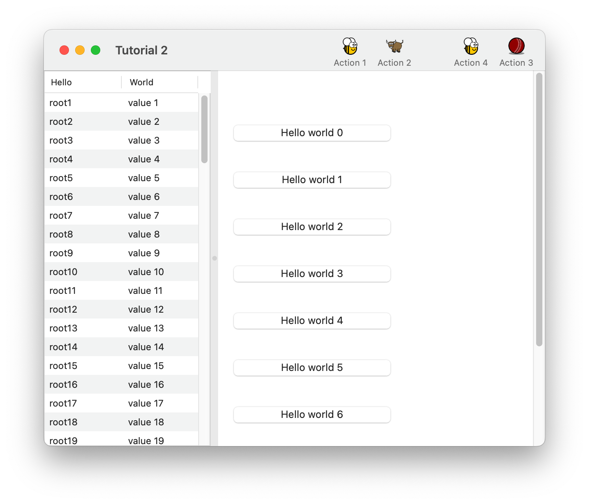
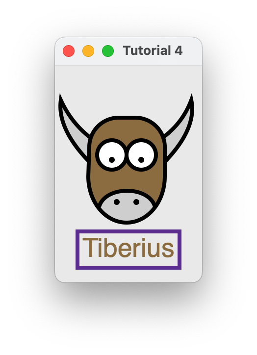

# Tutorials

/// note | Note

Is this the tutorial you're looking for?

If this is your first time using BeeWare, we suggestion you start with the [BeeWare tutorial](https://tutorial.beeware.org). This tutorial only covers BeeWare's GUI toolkit, Toga, and doesn't cover any of the details of getting your code running on specific hardware platforms. Once you've completed the BeeWare tutorial, this tutorial will introduce more details about Toga's capabilities as a GUI toolkit.

///

## A quick test drive

Before you run through the tutorial, [install a Toga app][get-started] to see what Toga looks like.

## Tutorial 0 - your first Toga app

In [Tutorial 0](tutorial-0.md), you will discover how to create a basic app and have a simple [`Button`][toga.Button] widget to click.

## Tutorial 1 - build a temperature converter

In [Tutorial 1](tutorial-1.md), you will discover how to capture basic user input using the [`TextInput`][toga.TextInput] widget and control layout.

## Tutorial 2 - organize layouts with nested boxes

In [Tutorial 2](tutorial-2.md), you will discover how to use the [`SplitContainer`][toga.SplitContainer] widget to display some components, a toolbar and a table.

{ width="300" }

/// caption

///

<!-- TODO: Update alt text -->

## Tutorial 3 - build a simple browser

In [Tutorial 3](tutorial-3.md), you will discover how to use the [`WebView`][toga.WebView] widget to display a simple browser.

{ width="300" }

/// caption

///

<!-- TODO: Update alt text -->

## Tutorial 4 - draw on a canvas

In [Tutorial 4](tutorial-4.md), you will discover how to use the [`Canvas`][toga.Canvas] widget to draw lines and shapes on a canvas.

{ width="300" }

/// caption

///

<!-- TODO: Update alt text -->
