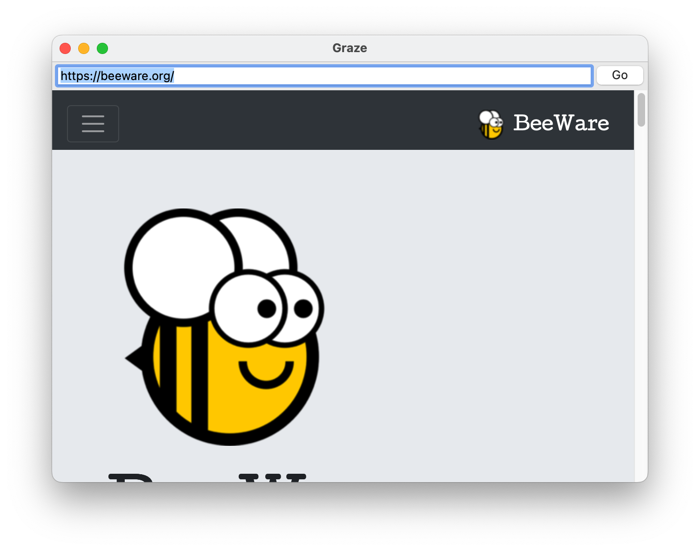

# Build a simple browser

Although it's possible to build complex GUI layouts, you can get a lot of functionality with very little code, utilizing the rich components that are native on modern platforms.

So - let's build a tool that lets our pet yak graze the web - a primitive web browser, in less than 40 lines of code!



Here's the source code:

```python
-8<- "tutorial3/tutorial/app.py"
```

In this example, you can see an application being developed as a class, rather than as a build method. You can also see boxes defined in a declarative manner - if you don't need to retain a reference to a particular widget, you can define a widget inline, and pass it as an argument to a box, and it will become a child of that box.

This is a simple example of something that *looks* a lot like a browser, but it's a long way from being a replacement for Chrome, Firefox or Safari. As a result, it's missing a lot of features. For example, it requires a full URL, starting with `http://` or `https://`. If you omit this prefix, and press the "Go" button, you'll see an error in the terminal where you started the app.

If you're feeling adventurous, you might try modifying the code to fix this. When the "Go" button is pressed, the `on_press` handler will sets URL of the web view to the content of the text view. Try modifying the `on_press` handler to check if the TextView content starts with a URL-like prefix - and if it doesn't, add `https://` to the start of the string that is used as the web view URL.

Another feature that is missing is that you have to press the button to make the URL load, pressing "enter" after typing a URL won't do anything. However, if you add an `on_confirm` handler to the text input, that handler will be invoked when you press enter. See if you can define an `on_confirm` handler that will do the same thing as the `on_press` handler of the button.
