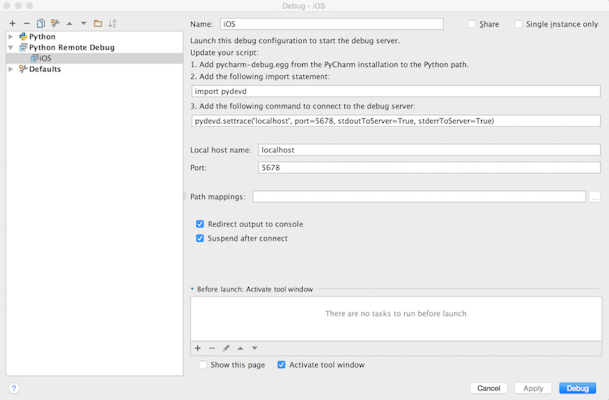
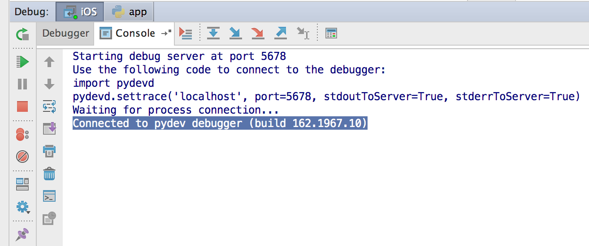
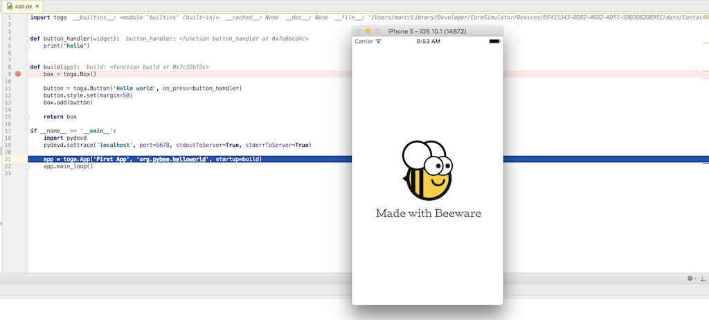
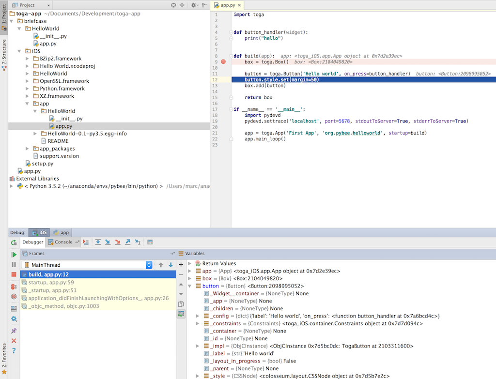

======================================
How to debug an app in iOS and Android
======================================

In this tutorial, we are going to show how to connect a python mobile
 application to a remote debugger server. For this, we are going to use
 ``PyCharm`` IDE and an iOS device.

Let's start with the Toga "HelloWorld" app::

    import toga

    def button_handler(widget):
        print("hello")

    def build(app):
        box = toga.Box()

        button = toga.Button('Hello world', on_press=button_handler)
        button.style.set(margin=50)
        box.add(button)

        return box

    if __name__ == '__main__':
        app = toga.App('First App', 'org.pybee.helloworld', startup=build)
        app.main_loop()

By using ``briefcase``, you can generate the iOS app::

    python setup.py ios

Modifying you app for remote debugging
--------------------------------------

``PyCharm`` uses ``pydev`` remote debugging. We have to import the ``pydevd``
 module and configure our remote server, by adding the following lines in your
``iOS`` app (``iOS/app/HelloWorld/app.py``)::

    if __name__ == '__main__':
        import pydevd
        pydevd.settrace('localhost', port=5678, stdoutToServer=True, stderrToServer=True)
        app = toga.App('First App', 'org.pybee.helloworld', startup=build)
        app.main_loop()

In the ``settrace`` call we indicate the host and port of our remote debug
 server, that in this case is our PC.

We also have to copy the ``pydevd`` library (provided by ``PyCharm``) to our app::

    cp pycharm-debug-py3k.egg iOS/app_packages/
    cd iOS/app_packages/
    unzip pycharm-debug-py3k.egg

.. note:: Python version

    If you are using Python 2, the right egg package is ``pycharm-debug.egg``

Configuring the remote debug server
-----------------------------------

In the ``Pycharm``IDE, you can configure a remote debugger server in
 ``Run -> Debug... -> Edit Configurations... -> + (Add New Configuration)`` by
 selecting ``Python Remote Debug``.

Here you can configure the IP address and port of the debug server (and should
 be the same configured in your app).

The debug server runs by pressing ``Debug`` button. You should see in the logs::

    Starting debug server at port 5678
    Use the following code to connect to the debugger:
    import pydevd
    pydevd.settrace('localhost', port=5678, stdoutToServer=True, stderrToServer=True)
    Waiting for process connection...

Debugging the app
-----------------

In ``Xcode``, run the app in the ``iOS`` simulator and wait until the app
 connects with the debugging server. You should see this message:

and you also can see that the debugging controls are enabled and the app is
 stopped after the ``settrace`` line.

From here you can debug the app as usual. For example, you can add a breakpoint
 in the first line of ``build`` function and press the ``Resume program``button
 (the green arrow in the top left of the debug box).

If you step over a couple of lines, you can see how ``button`` created:

