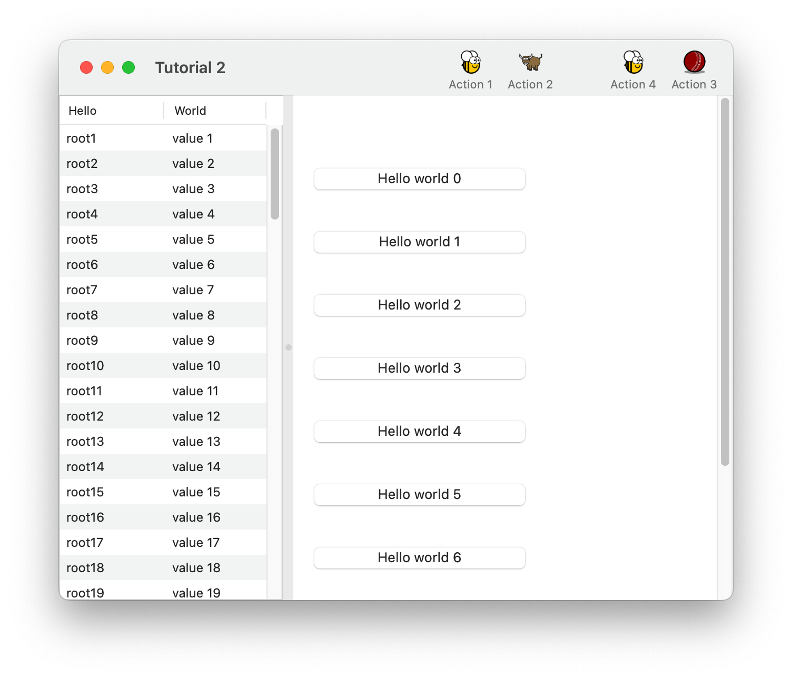

====
Toga
====

Toga is a Python native, OS native, cross platform GUI toolkit. Toga consists of a
library of base components with a shared interface to simplify platform-agnostic GUI
development.

Toga is available on macOS, Windows, Linux (GTK), Android, iOS, and for
single-page web apps.

.. rst-class::  row

Table of contents
=================

:ref:`Tutorial <tutorial>`
--------------------------

Get started with a hands-on introduction to Toga for beginners.

:ref:`How-to guides <how-to>`
-----------------------------

Guides and recipes for common problems and tasks.

:ref:`Background <background>`
------------------------------

Explanation and discussion of key topics and concepts.

:ref:`Reference <reference>`
----------------------------

Technical reference - commands, modules, classes, methods.

Community
=========

Toga is part of the `BeeWare suite`_. You can talk to the community through:

* `@beeware@fosstodon.org on Mastodon`_
* `Discord`_
* The Toga `Github Discussions forum`_

We foster a welcoming and respectful community as described in our
`BeeWare Community Code of Conduct`_.

.. _BeeWare suite: https://beeware.org/
.. _@beeware@fosstodon.org on Mastodon: https://fosstodon.org/@beeware
.. _Discord: https://beeware.org/bee/chat/
.. _Github Discussions forum: https://github.com/beeware/toga/discussions
.. _BeeWare Community Code of Conduct: https://beeware.org/community/behavior/

.. toctree::
   :maxdepth: 2
   :hidden:
   :titlesonly:

   tutorial/index
   how-to/index
   reference/index
   background/index
