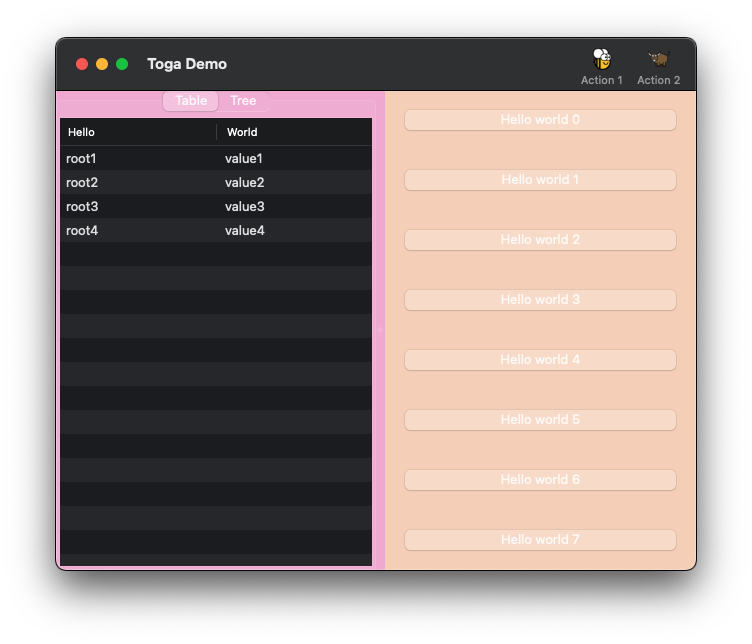
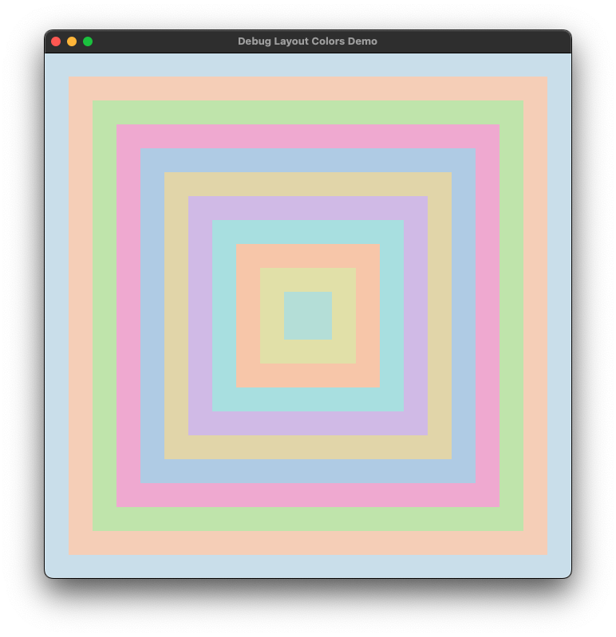

==================
Debugging Your App
==================

Debugging is the process of finding, understanding, and fixing bugs in your code.

.. _debug-layout:

Debugging Widget Layout
=======================

The debug layout colors tool is designed to give all containers distinct colors, which enables you to better see what might be happening with the layout, and more easily debug problems with it.

Enabling the tool can be done two ways. You can enable it by setting the ``TOGA_DEBUG_LAYOUT`` `environment variable <https://superuser.com/questions/284342/what-are-path-and-other-environment-variables-and-how-can-i-set-or-use-them>`__ equal to ``1``, which lets you use it even for code you can't or don't want to alter. Setting environment variables varies by operating system. Alternatively, you can enable it from within your code by including the following in your app file or your ``app.py``:

.. code-block:: python

    toga.Widget.DEBUG_LAYOUT_ENABLED = True

Debug layout colors with the ``toga-demo``
-------------------------------------------

To use the debug layout with the ``toga-demo``, set the environment variable, and :doc:`install and run the demo <../tutorial/get-started>`.

You should see the following.

If a box or other widget expands to fill its entire parent, you won't see the parent widget behind it. The ``toga-demo`` has two widgets hiding others, and so it only shows two colors.

A more illustrative example
---------------------------

This example uses a series of nested boxes to show a variety of available colors. The tool is enabled here in the code.

.. code-block:: python

    import toga

    toga.Widget.DEBUG_LAYOUT_ENABLED = True

    class DebugLayoutColors(toga.App):
        def startup(self):
            main_box = toga.Box()
            prev_box = main_box
            for _ in range(1, 12):
                new_box = toga.Box(margin=30)
                prev_box.add(new_box)
                prev_box = new_box

            self.main_window = toga.MainWindow(content=main_box)
            self.main_window.show()

    def main():
        return DebugLayoutColors("Debug Layout Colors Demo", "org.beeware.toga.debug.layout")

    if __name__ == "__main__":
        main().main_loop()

Save the example as a Python file on your computer. When you run the file, you should see the following.

