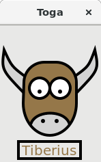

.. _tutorial:

=========
Tutorials
=========

.. toctree::
   :maxdepth: 1
   :titlesonly:

   tutorial-0
   tutorial-1
   tutorial-2
   tutorial-3

Tutorial 0 - your first Toga app
================================

In :doc:`tutorial-0`, you will discover how to create a basic app and have a simple :mod:`toga.interface.widgets.button.Button` widget to click.

Tutorial 1 - a slightly less toy example
========================================

In :doc:`tutorial-1`, you will discover how to capture basic user input using the :mod:`toga.interface.widgets.textinput.TextInput` widget
and control layout.

Tutorial 2 - you put the box inside another box...
==================================================

In :doc:`tutorial-2`, you will discover how to use the :mod:`toga.interface.widgets.splitcontainer.SplitContainer` widget to display
some components, a toolbar and a table.

.. figure:: screenshots/tutorial-2.png
    :align: center
    :width: 300

Tutorial 3 - let's build a browser!
===================================

In :doc:`tutorial-3`, you will discover how to use the :mod:`toga.interface.widgets.webview.WebView` widget to display
a simple browser.

.. figure:: screenshots/tutorial-3.png
    :align: center
    :width: 300

Tutorial 4 - let's draw on a canvas! (Gtk+ only for now)
===================================

In :doc:`tutorial-4`, you will discover how to use the :mod:`toga.interface.widgets.canvas.Canvas` widget to draw
lines and shapes on a canvas.

