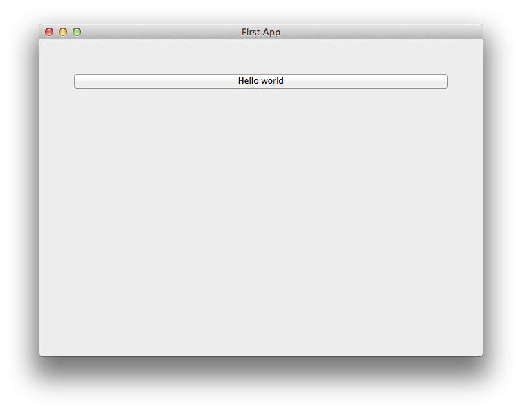

===================
Your first Toga app
===================

.. include:: /tutorial/tutorial-issues-note.rst

In this example, we're going to build a desktop app with a single
button, that prints to the console when you press the button.

Set up your development environment
===================================

Open a command prompt on your computer and make sure that you can successfully run the :code:`python3` command. Create a working directory for your code and change to it.
If Python 3 is *not* installed, you can do so via `the official installer <https://www.python.org/downloads>`_, or via `pyenv <https://github.com/pyenv/pyenv#simple-python-version-management-pyenv>`_, as described in the `environment page <https://beeware.org/contributing/how/first-time/setup>`_.

The recommended way of setting up your development environment for Toga
is to install a virtual environment, install the required dependencies and
start coding. To set up a virtual environment, run:

.. tabs::

  .. group-tab:: macOS

    .. code-block:: bash

      $ python3 -m venv venv
      $ source venv/bin/activate

  .. group-tab:: Linux

    .. code-block:: bash

      $ python3 -m venv venv
      $ source venv/bin/activate

  .. group-tab:: Windows

    .. code-block:: doscon

      C:\...>py -m venv venv
      C:\...>venv\Scripts\activate.bat

Your prompt should now have a ``(venv)`` prefix in front of it.

If you are using Python 3.7 on Windows, you might get an error in the next step. Before proceeding, download unofficial pythonnet wheel file from `<https://www.lfd.uci.edu/~gohlke/pythonlibs/#pythonnet>`_ to your current directory, rename it to ``pythonnet.whl`` and run:

.. tabs::

  .. group-tab:: Windows

    .. code-block:: doscon

      C:\..> pip install pythonnet.whl

Next, install Toga into your virtual environment:

.. tabs::

  .. group-tab:: macOS

    .. code-block:: bash

      (venv) $ pip install --pre toga

  .. group-tab:: Linux

    .. code-block:: bash

      (venv) $ pip install --pre toga

  .. group-tab:: Windows

    .. code-block:: doscon

      (venv) C:\...>pip install --pre toga

After a successful installation of Toga you are ready to get coding.

Write the app
=============

Create a new file called ``helloworld.py`` and add the following code for the "Hello world" app:

.. literalinclude:: /../examples/tutorial0/tutorial/app.py
   :language: python

Let's walk through this one line at a time.

The code starts with imports. First, we import toga::

    import toga

Then we set up a handler, which is a wrapper around behavior that we want to activate
when the button is pressed. A handler is just a function. The function takes
the widget that was activated as the first argument; depending on the type of
event that is being handled, other arguments may also be provided. In the case
of a simple button press, however, there are no extra arguments::

    def button_handler(widget):
        print("hello")

When the app gets instantiated (in `main()`, discussed below), Toga will create a window with a menu. We need to provide a method that tells Toga what content to display in the window. The method can be named anything, it just needs to accept an app instance::

    def build(app):

We want to put a button in the window. However, unless we want the button to
fill the entire app window, we can't just put the button into the app window.
Instead, we need create a box, and put the button in the box.

A box is an object that can be used to hold multiple widgets, and to
define padding around widgets. So, we define a box::

        box = toga.Box()

We can then define a button. When we create the button, we can set the button
text, and we also set the behavior that we want to invoke when the button is
pressed, referencing the handler that we defined earlier::

        button = toga.Button('Hello world', on_press=button_handler)

Now we have to define how the button will appear in the window. By default,
Toga uses a style algorithm called ``Pack``, which is a bit like "CSS-lite".
We can set style properties of the button::

        button.style.padding = 50

What we've done here is say that the button will have a padding of 50 pixels
on all sides. If we wanted to define padding of 20 pixels on top of the
button, we could have defined ``padding_top = 20``, or we could have specified
the ``padding = (20, 50, 50, 50)``.

Now we will make the button take up all the available width::

       button.style.flex = 1

The ``flex`` attribute specifies how an element is sized with respect to other
elements along its direction. The default direction is row (horizontal) and
since the button is the only element here, it will take up the whole width.
Check out `style docs <https://toga.readthedocs.io/en/latest/reference/style/pack.html#flex>`_
for more information on how to use the ``flex`` attribute.

The next step is to add the button to the box::

        box.add(button)

The button has a default height, defined by
the way that the underlying platform draws buttons). As a result, this means
we'll see a single button in the app window that stretches to the width of the
screen, but has a 50 pixel space surrounding it.

Now we've set up the box, we return the outer box that holds all
the UI content. This box will be the content of the app's main window::

        return box

Lastly, we instantiate the app itself. The app is a high level container
representing the executable. The app has a name and a unique identifier. The
identifier is used when registering any app-specific system resources. By
convention, the identifier is a "reversed domain name". The app also accepts
our method defining the main window contents. We wrap this creation process
into a method called `main()`, which returns a new instance of our application::

    def main():
        return toga.App('First App', 'org.beeware.helloworld', startup=build)

The entry point for the project then needs to instantiate this entry point
and start the main app loop. The call to `main_loop()` is a blocking call;
it won't return until you quit the main app::

    if __name__ == '__main__':
        main().main_loop()

And that's it! Save this script as ``helloworld.py``, and you're ready to go.

Running the app
---------------

The app acts as a Python module, which means you need to run it in a different manner than running a regular Python script: You need to specify the :code:`-m` flag and *not* include the :code:`.py` extension for the script name. 

Here is the command to run for your platform from your working directory:

.. tabs::

  .. group-tab:: macOS

    .. code-block:: bash

      (venv) $ python -m helloworld

  .. group-tab:: Linux

    .. code-block:: bash

      (venv) $ python -m helloworld

  .. group-tab:: Windows

    .. code-block:: doscon

      (venv) C:\...>python -m helloworld

This should pop up a window with a button:

If you click on the button, you should see messages appear in the console.
Even though we didn't define anything about menus, the app will have default
menu entries to quit the app, and an About page. The keyboard bindings to quit
the app, plus the "close" button on the window will also work as expected. The
app will have a default Toga icon (a picture of Tiberius the yak).

Troubleshooting issues
----------------------

Occasionally you might run into issues running Toga on your computer.

Before you run the app, you'll need to install toga. Although you *can* install
toga by just running::

    $ pip install --pre toga

We strongly suggest that you **don't** do this. We'd suggest creating a `virtual
environment`_ first, and installing toga in that virtual environment as directed at the top of this guide.

.. _virtual environment: http://docs.python-guide.org/en/latest/dev/virtualenvs/

.. note:: Minimum versions

    Toga has some minimum requirements:

    * If you're on OS X, you need to be on 10.7 (Lion) or newer.

    * If you're on Linux, you need to have GTK+ 3.4 or later. This is the
      version that ships starting with Ubuntu 12.04 and Fedora 17.

    * If you want to use the WebView widget, you'll also need to
      have WebKit, plus the GI bindings to WebKit installed.

        * For Ubuntu that's provided by the ``libwebkitgtk-3.0-0`` and
          ``gir1.2-webkit-3.0`` packages.

        * For Fedora it's all provided in the ``webkitgtk3`` package.

    If these requirements aren't met, Toga either won't work at all, or won't
    have full functionality.

Once you've got toga installed, you can run your script::

    (venv) $ python -m helloworld

.. note:: ``python -m helloworld`` vs ``python helloworld.py``

    Note the ``-m`` flag and absence of the ``.py`` extension in this command
    line. If you run ``python helloworld.py``, you may see some errors like::

        NotImplementedError: Application does not define open_document()

    Toga apps must be executed as modules - hence the ``-m`` flag.
