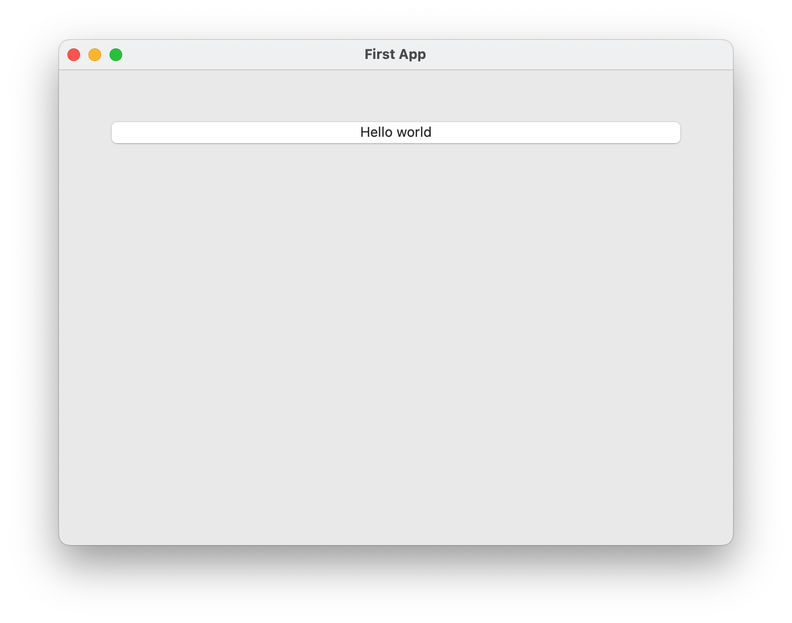

===================
Your first Toga app
===================

In this example, we're going to build a desktop app with a single
button, that prints to the console when you press the button.

Here's a complete code listing for our "Hello world" app::

    from __future__ import print_function, unicode_literals, absolute_import

    import toga

    def button_handler(widget):
        print("hello")

    def build(app):
        container = toga.Container()

        button = toga.Button('Hello world', on_press=button_handler)

        container.add(button)

        container.constrain(button.TOP == container.TOP + 50)
        container.constrain(button.LEADING == container.LEADING + 50)
        container.constrain(button.TRAILING + 50 == container.TRAILING)
        container.constrain(button.BOTTOM + 50 < container.BOTTOM)

        return container

    if __name__ == '__main__':
        app = toga.App('First App', 'org.pybee.helloworld', startup=build)

        app.main_loop()

Lets walk through this one line at a time.

The code starts with imports. First, we have some ``__future__`` imports.
These to make Python 2 behave a bit more like Python 3. If you're using Python
3, you can omit this line::

    from __future__ import print_function, unicode_literals, absolute_import

Next, we import toga::

    import toga

Then, we set up a handler - a wrapper around behavior that we want to activate
when the button is pressed. A handler is just a function. The function takes
the widget that was activated as the first argument; depending on the type of
event that is being handled, other arguments may also be provided. In the case
of a simple button press, however, there are no extra arguments::

    def button_handler(widget):
        print("hello")

By creating an app, we're declaring that we want to have a main window, with a
main menu. However, Toga doesn't know what we want content we want in that
main window. The next step is to define a method that describes the UI that we
want our app to have. This method is a callable that accepts an app instance::

    def build(app):

We want to put a button in the window. However, unless we want the button to
fill the entire app window, we can't just put the button into the app window.
Instead, we need create a container, and put the button in the container.

A container is an object that can be used to hold multiple widgets, and to
define padding around widgets. So, we define a container::

        container = toga.Container()

We can then define a button. When we create the button, we set can the button
text, and we also set the behavior that we want to invoke when the button is
pressed, referencing the handler that we defined earlier::

        button = toga.Button('Hello world', on_press=button_handler)

Then, we add the button to the container::

        container.add(button)

Now we have to define where the button will sit inside the container. Many
widget toolkits do this by specifying an exact pixel position, or by
specifying a box model (usually a grid, or some sort of box packing
structure).

Toga, however, uses a constraint-based approach. To define how a container is
laid out, you specify the spatial relationships between the container and the
widget, or between the widget and other widgets.

This is done using the `constrain()` method on a container; the `constrain()`
call takes expressions that define the relationships you want to impose::

        container.constrain(button.TOP == container.TOP + 50)
        container.constrain(button.LEADING == container.LEADING + 50)
        container.constrain(button.TRAILING + 50 == container.TRAILING)
        container.constrain(button.BOTTOM + 50 < container.BOTTOM)

In this case, we've defined 4 constraints:

    * The top of the button is 50 pixels lower than the top of the container

    * The leading edge of the button is 50 pixels further to the right than
      the leading edge of the container. The "leading" edge is a localization-
      sensitive way of saying "left" or "right" - in a left-to-right language
      like English, the leading edge is the left hand side; in a right-to-left
      language like Hebrew or Arabic, the leading edge is the right hand side.
      If you really want to use the left or right edge, regardless of language
      direction, the identifiers ``LEFT`` and ``RIGHT`` can be used.

    * The trailing edge of the container is 50 pixels further to the right
      than the trailing end of the button. The "trailing" edge is the right
      hand side in a right-to-left language.

    * The bottom of the container must be more than 50 pixel further down than
      the bottom of the button.

This set of constraints is enough to uniquely place the button - but it also
describes how the button will change size as the window changes size. As the
window gets wider, the button will get wider to ensure that constraints 2 and
3 are satisfied. However, the vertical position of the button won't change as
the  window gets taller; the fourth constraint ensures that any extra height
will go into the space below the button.

.. note:: The Cassowary Algorithm

    This approach to GUI layout has a strong mathematical basis - it's based on
    an algorithm called `Cassowary`_. It's also the basis of the widget
    auto-layouts tools introduced in OS X 10.7 and iOS 6.

.. _Cassowary: http://www.cs.washington.edu/research/constraints/cassowary/

Now we've set up the container, we return the outer container that holds all
the UI content. This container will be the content of the app's main window::

        return container

Lastly, we get into the main body of the program, where we create the app itself.
The app is a high level container representing the executable. The app has a name,
and a unique identifier. The identifier is used when registering any app-specific
system resources. By convention, the identifier is a  "reversed domain name".
The app also accepts our callable defining the main window contents::

    if __name__ == '__main__':

        app = toga.App('First App', 'org.pybee.helloworld', startup=build)

Having created the app, we can start the main app loop. This is a blocking
call; it won't return until you quit the main app::

        app.main_loop()

And that's it! Save this script as ``helloworld.py``, and you're ready to go.

Running the app
---------------

Before you run the app, you'll need to install toga. Although you *can* install
toga by just running::

    $ pip install toga

We strongly suggest that you **don't** do this. We'd suggest creating a `virtual
environment`_ first, and installing toga in that virtual environment.

.. _virtual environment: http://docs.python-guide.org/en/latest/dev/virtualenvs/

.. note:: Minimum versions

    Toga has some minimum requirements:

    * If you're on OS X, you need to be on 10.7 (Lion) or newer.

    * If you're on Linux, you need to have GTK+ 3.4 or later. This is the
      version that ships with Ubuntu 12.04. If you want to use the WebView
      widget, you'll also need to have WebKit, plus the GI bindings to WebKit
      (gir1.2-webkit-3.0) installed.

    If these requirements aren't met, Toga either won't work at all, or won't
    have full functionality.

.. note:: Problems with source installs

    Internally, Toga is comprised of a number of subpackages - one for each
    platform it supports. If you install using wheels, the install process will
    correctly identify the required packages and install them. However, if you
    install from source using pip, there is a `known bug in pip`_ that causes
    dependencies to not be installed. It may be necessary to manually install
    the following pre-requisites:

    * OS X: ``pip install toga-cocoa``
    * Linux: ``pip install toga-gtk toga-cassowary cassowary``
    * Win32: ``pip install toga-win32 toga-cassowary cassowary``

.. _known bug in pip: https://github.com/pypa/pip/issues/1951

.. note:: Problems under Linux

    Unfortunately, GTK+3 doesn't provide a pip-installable version of it's Python
    bindings, so if you're using a virtual environment with --no-site-packages
    installed (which is the default), GTK+ won't be in your ``PYTHONPATH`` inside
    a virtual environment.

    To make the system GTK+ bindings available to your virtualenv,
    symlinking the `gi` module from the system dist-packages directory into your
    virtualenv's site-packages::

        $ cd $VIRTUAL_ENV/lib/python2.7/site-packages
        $ ln -si /usr/lib/python2.7/dist-packages/gi

Once you've got toga installed, you can run your script::

    $ python helloworld.py

This should pop up a window with a button:

If you click on the button, you should see messages appear in the console.
Even though we didn't define anything about menus, the app will have default
menu entries to quit the app, and an About page. The keyboard bindings to quit
the app, plus the "close" button on the window will also work as expected. The
app will have a default Toga icon (a picture of Tiberius the yak).
