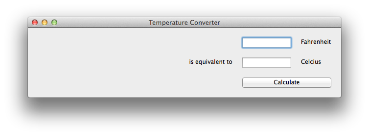

===========================
A slightly less toy example
===========================

Most applications require a little more than a button on a page. Lets
build a slightly more complex example - a Fahrenheit to Celsius converter:

Here's the source code:

.. literalinclude:: /../examples/tutorial1/tutorial/app.py
   :language: python

This example shows off some more features of Toga's Pack style engine.
In this example app, we've set up an outer box that stacks vertically;
inside that box, we've put 2 horizontal boxes and a button.

Since there's no width styling on the horizontal boxes, they'll try to
fit the widgets they contain into the available space. The ``TextInput``
widgets have a style of ``flex=1``, but the ``Label`` widgets have a fixed
width; as a result, the ``TextInput`` widgets will be stretched to fit the
available horizontal space. The margin and padding terms then ensure that the
widgets will be aligned vertically and horizontally.
