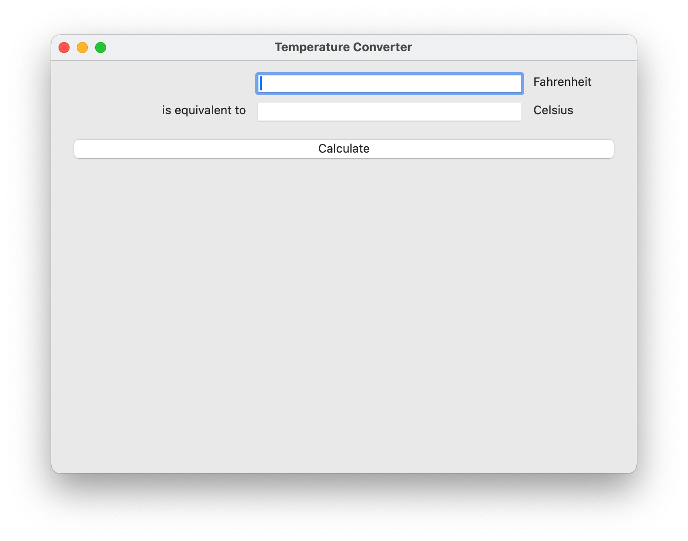

===========================
A slightly less toy example
===========================

Most applications require a little more than a button on a page. Lets
build a slightly more complex example - a Fahrenheit to Celcius converter:

Here's the source code::

    from __future__ import print_function, unicode_literals, absolute_import

    import toga

    def build(app):
        container = toga.Container()

        c_input = toga.TextInput(readonly=True)
        f_input = toga.TextInput()

        c_label = toga.Label('Celcius', alignment=toga.LEFT_ALIGNED)
        f_label = toga.Label('Fahrenheit', alignment=toga.LEFT_ALIGNED)
        join_label = toga.Label('is equivalent to', alignment=toga.RIGHT_ALIGNED)

        def calculate(widget):
            try:
                c_input.value = (float(f_input.value)- 32.0) * 5.0 / 9.0
            except:
                c_input.value = '???'

        button = toga.Button('Calculate', on_press=calculate)

        container.add(c_input)
        container.add(f_input)

        container.add(c_label)
        container.add(f_label)
        container.add(join_label)

        container.add(button)

        container.constrain(f_input.WIDTH == 100)
        container.constrain(f_input.TRAILING + 20 == f_label.LEADING)
        container.constrain(f_label.TRAILING + 20 == container.TRAILING)
        container.constrain(f_input.TOP == container.TOP + 20)
        container.constrain(f_input.TOP == f_label.TOP)

        container.constrain(c_input.WIDTH == f_input.WIDTH)
        container.constrain(c_label.WIDTH == f_label.WIDTH)
        container.constrain(c_input.TRAILING + 20 == c_label.LEADING)
        container.constrain(c_label.TRAILING + 20 == container.TRAILING)
        container.constrain(c_input.TOP == f_input.BOTTOM + 20)
        container.constrain(c_input.TOP == c_label.TOP)

        container.constrain(c_input.LEADING == f_input.LEADING)
        container.constrain(join_label.TOP == c_label.TOP)
        container.constrain(join_label.LEADING == container.LEADING + 20)
        container.constrain(join_label.TRAILING + 20 == c_input.LEADING)

        container.constrain(button.TOP == c_input.BOTTOM + 20)
        container.constrain(button.LEADING == c_input.LEADING)
        container.constrain(button.TRAILING == c_label.TRAILING)
        container.constrain(button.BOTTOM + 20 == container.BOTTOM)

        return container

    if __name__ == '__main__':
        app = toga.App('Temperature Converter', 'org.pybee.f_to_c', startup=build)

        app.main_loop()
