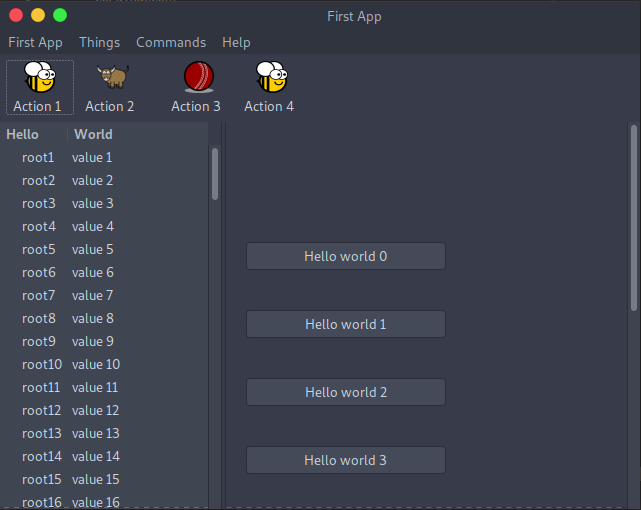

=====================================
You put the box inside another box...
=====================================

If you've done any GUI programming before, you will know that one of the
biggest problems that any widget toolkit solves is how to put widgets on the
screen in the right place. Different widget toolkits use different approaches
- constraints, packing models, and grid-based models are all common. Toga uses
an approach that  is new for widget toolkits, but well proven in computing:
Cascading Style Sheets, (CSS).

If you've done any design for the web, you will have come across CSS before as
the mechanism that you use to lay out HTML on a web page. Although this is the
reason CSS was developed, CSS itself is a general set of rules for laying out
any "boxes" that are structured in a tree-like heirarchy. GUI widgets are an
example of one such structure.

To see how this works in practice, lets look at a more complex example,
involving layouts, scrollers, and containers inside other containers.:

Here's the source code::

    import toga
    from colosseum import CSS

    def button_handler(widget):
        print('button handler')
        for i in range(0, 10):
            print("hello", i)
            yield 1
        print("done", i)

    def action1(widget):
        print("action 1")

    def action2(widget):
        print("action 2")

    def action3(widget):
        print("action 3")

    if __name__ == '__main__':

        def build(app):
            left_container = toga.Table(['Hello', 'World'])

            left_container.insert(None, 'root1', 'value1')
            left_container.insert(None, 'root2', 'value2')
            left_container.insert(None, 'root3', 'value3')
            left_container.insert(1, 'root4', 'value4')

            for i in range(0, 100):
                left_container.insert(None, 'root%s' % (i+5), 'value%s' % (i+5))

            right_content = toga.Box(
                style=CSS(flex_direction='column', padding_top=50)
            )

            for b in range(0, 10):
                right_content.add(
                    toga.Button(
                        'Hello world %s' % b,
                        on_press=button_handler,
                        style=CSS(width=200, margin=20)
                    )
                )

            right_container = toga.ScrollContainer(horizontal=False)

            right_container.content = right_content

            split = toga.SplitContainer()

            split.content = [left_container, right_container]

            cmd1 = toga.Command(
                action1, 'Action 1',
                tooltip='Perform action 1',
                icon='icons/brutus.icns'
            )
            cmd2 = toga.Command(
                action2, 'Action 2',
                tooltip='Perform action 2',
                icon=toga.TIBERIUS_ICON
            )
            cmd3 = toga.Command(
                action3, 'Action 3',
                tooltip='Perform action 3',
                icon='icons/cricket-72.png'
            )

            def action4(widget):
                print ("CALLING Action 4")
                cmd3.enabled = not cmd3.enabled

            cmd4 = toga.Command(
                action4, 'Action 4',
                tooltip='Perform action 4',
                icon='icons/brutus.icns'
            )

            app.main_window.toolbar = [
                cmd1, toga.SEPARATOR, cmd2, toga.SPACER, cmd3,
                toga.EXPANDING_SPACER,
                cmd4
            ]

            return split

        app = toga.App('First App', 'org.pybee.helloworld', startup=build)

        app.main_loop()

In this example, we see a couple of new Toga widgets - ``Table``,
``SplitContainer``, and ``ScrollContainer``. You can also see that
CSS styles can be added in the widget constructor. Lastly, you can
see that windows can have toolbars.
