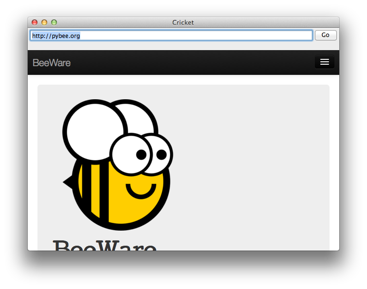

======================
Let's build a browser!
======================

Although it's possible to build complex GUI layouts, you can get a lot
of functionality with very little code, utilizing the rich components that
are native on modern platforms.

So - lets build a tool that lets our pet yak graze the web - a primitive
web browser, in less than 40 lines of code!

Here's the source code::

    #!/usr/bin/env python

    import toga
    from colosseum import CSS

    class Graze(toga.App):
        def startup(self):
            self.main_window = toga.MainWindow(self.name)
            self.main_window.app = self

            self.webview = toga.WebView(style=CSS(flex=1))
            self.url_input = toga.TextInput(
                initial='https://github.com/',
                style=CSS(flex=1, margin=5)
            )

            box = toga.Box(
                children = [
                    toga.Box(
                        children = [
                            self.url_input,
                            toga.Button('Go', on_press=self.load_page, style=CSS(width=50)),
                        ],
                        style=CSS(
                            flex_direction='row'
                        )
                    ),
                    self.webview,
                ],
                style=CSS(
                    flex_direction='column'
                )
            )

            self.main_window.content = box
            self.webview.url = self.url_input.value

            # Show the main window
            self.main_window.show()

        def load_page(self, widget):
            self.webview.url = self.url_input.value

    if __name__ == '__main__':
        app = Graze('Graze', 'org.pybee.graze')

        app.main_loop()

In this example, you can see an application being developed as a class, rather
than as a build method. You can also see boxes defined in a declarative
manner - if you don't need to retain a reference to a particular widget, you
can define a widget inline, and pass it as an argument to a box, and it
will become a child of that box.
