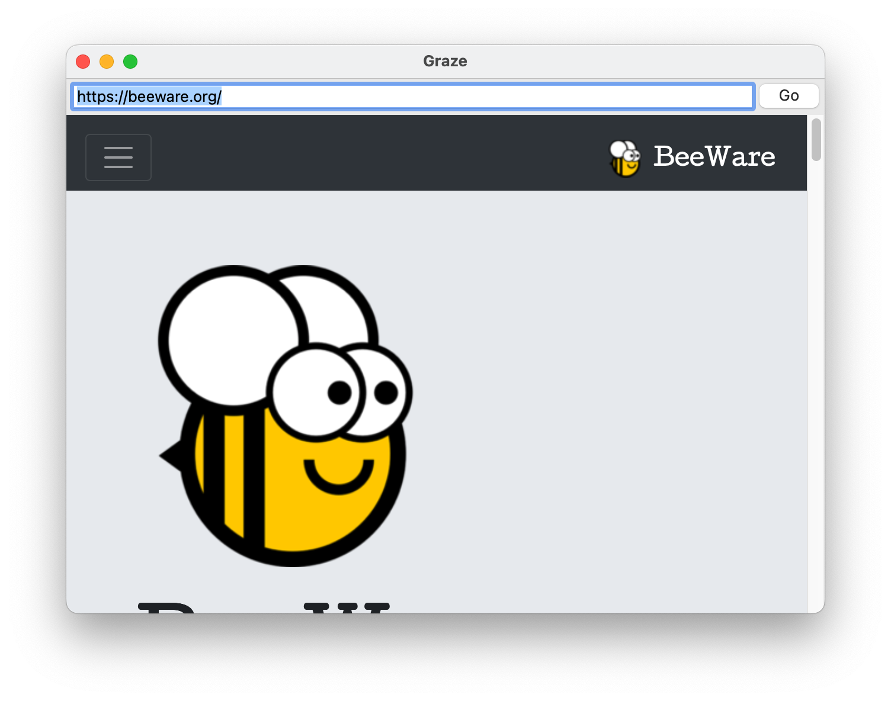

======================
Let's build a browser!
======================

Although it's possible to build complex GUI layouts, you can get a lot
of functionality with very little code, utilizing the rich components that
are native on modern platforms.

So - lets build a tool that lets our pet yak graze the web - a primitive
web browser, in less than 40 lines of code!

Here's the source code::

    #!/usr/bin/env python
    from __future__ import print_function, unicode_literals, absolute_import

    import toga

    class Graze(toga.App):
        def startup(self):
            container = toga.Container()

            self.webview = toga.WebView()
            self.url_input = toga.TextInput('http://pybee.org/')

            go_button = toga.Button('Go', on_press=self.load_page)

            container.add(self.webview)
            container.add(self.url_input)
            container.add(go_button)

            container.constrain(self.url_input.TOP == container.TOP + 5)
            container.constrain(self.url_input.LEFT == container.LEFT + 5)
            container.constrain(self.url_input.RIGHT + 5 == go_button.LEFT)

            container.constrain(go_button.TOP == container.TOP + 5)
            container.constrain(go_button.RIGHT + 5 == container.RIGHT)

            container.constrain(self.webview.TOP == self.url_input.BOTTOM + 20)
            container.constrain(self.webview.BOTTOM == container.BOTTOM)
            container.constrain(self.webview.RIGHT == container.RIGHT)
            container.constrain(self.webview.LEFT == container.LEFT)

            app.main_window.content = container

        def load_page(self, widget):
            self.webview.url = self.url_input.value

    if __name__ == '__main__':
        app = Graze('Graze', 'org.pybee.graze')

        app.main_loop()
