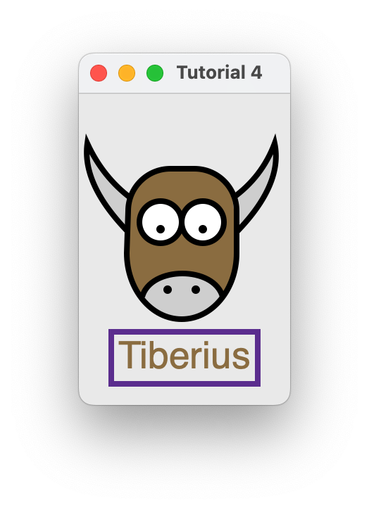

=======================
Let's draw on a canvas!
=======================

.. include:: /tutorial/tutorial-issues-note.rst

One of the main capabilities needed to create many types of GUI applications is
the ability to draw and manipulate lines, shapes, text, and other graphics. To
do this in Toga, we use the Canvas Widget.

Utilizing the Canvas is as easy as determining the drawing operations you want to
perform and then creating a new Canvas. All drawing objects that are created
with one of the drawing operations are returned so that they can be modified or
removed.

1. We first define the drawing operations we want to perform in a new function::

    def draw_eyes(self):
        with self.canvas.fill(color=WHITE) as eye_whites:
            eye_whites.arc(58, 92, 15)
            eye_whites.arc(88, 92, 15, math.pi, 3 * math.pi)

Notice that we also created and used a new fill context called eye_whites. The
"with" keyword that is used for the fill operation causes everything draw using
the context to be filled with a color. In this example we filled two circular
eyes with the color white.

2. Next we create a new Canvas::

    self.canvas = toga.Canvas(style=Pack(flex=1))

That's all there is to! In this example we also add our canvas to the MainWindow
through use of the Box Widget::

        box = toga.Box(children=[self.canvas])
        self.main_window.content = box

You'll also notice in the full example below that the drawing operations utilize
contexts in addition to fill including context, closed_path, and stroke. This
reduces the repetition of commands as well as groups drawing operations so that
they can be modified together.

Here's the source code

.. literalinclude:: /../examples/tutorial4/tutorial/app.py
   :language: python

In this example, we see a new Toga widget - :class:`.Canvas`.
